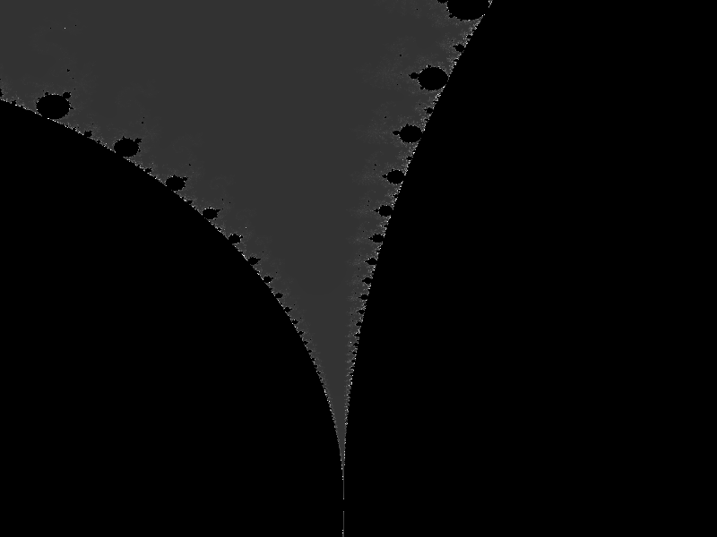

# Mandelbrot
A program I made in Rust that generates images of the Mandelbrot fractal.

## Usage:
./mandelbrot
  [-o/--output {filename}]
  [-c/--center {center coordinates}]
  [-z/zoom {zoom factor}]

## Compiling:
To compile, run `make`.
